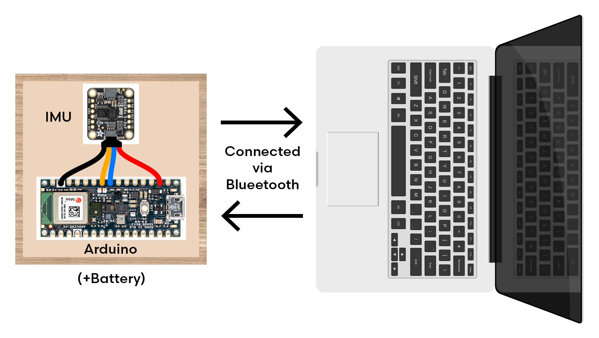
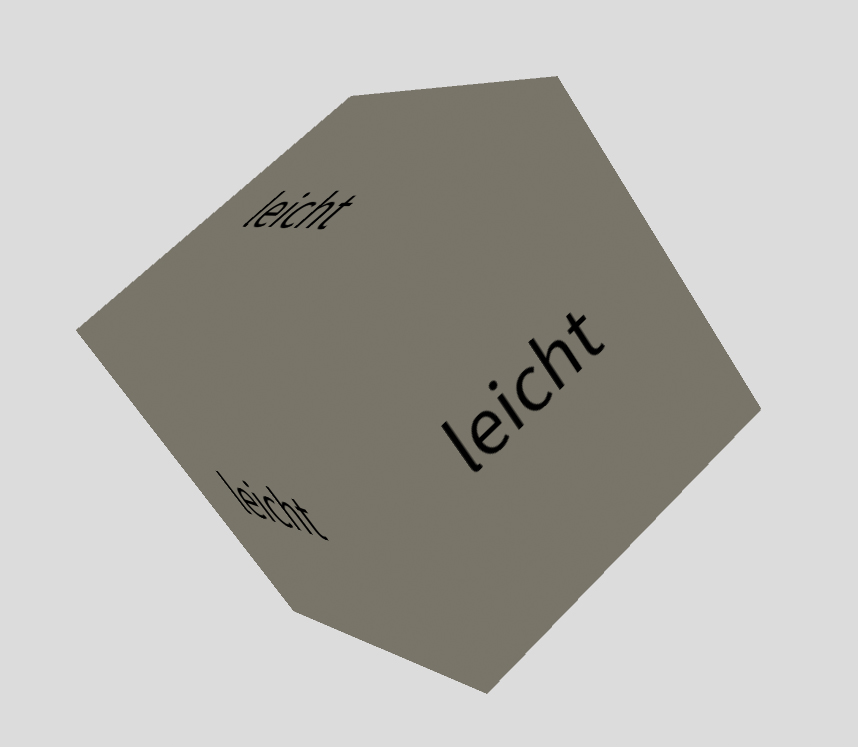

# Bachelor's Thesis

## Title TBA

### Supervisor
DI (FH) Dr. Martin Murer  

---

### Structure

A wooden cube with an `Arduino` (Nano 33 BLE), `Inertial Measurement Unit` (IMU - BNO08X) and a Battery is connected via Bluetooth to a Laptop.

The connection via Bluetooth (BLE) is established by a Python script. This script also includes the transfer of rotation and acceleration data from the IMU (via Arduino) to Processing (using OSC).

In Processing, a digital 3D cube is presented with either "leicht" (light) or "schwer" (heavy) written on its faces.

---

### Trials
The users then conduct a simple trial:
- Read the description on the cube (light or heavy)
- Lift the cube onto a box placed behind the cube
- Let go of the cube for a second
- Put the cube back into its original position
- Press space bar for the next trial

---

### Data and Evaluation
In the background, `Python` creates `.csv` files with the raw acceleration data, as well as another file including the duration of the trial from `lift` (a certain threshold) to `rest` (another threshold).
I then use `R` to analyze the recorded raw data (in progress).

---